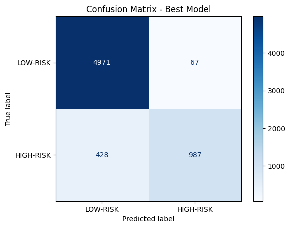
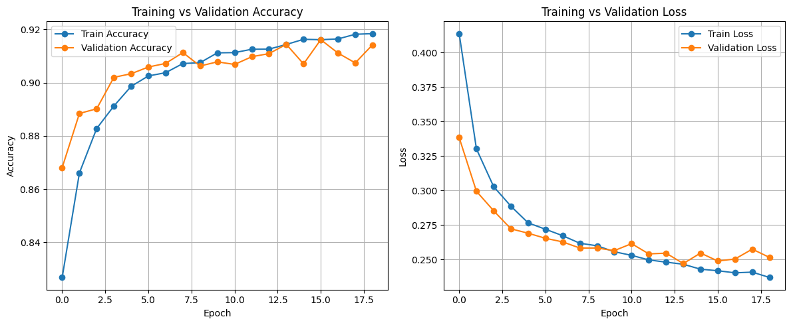
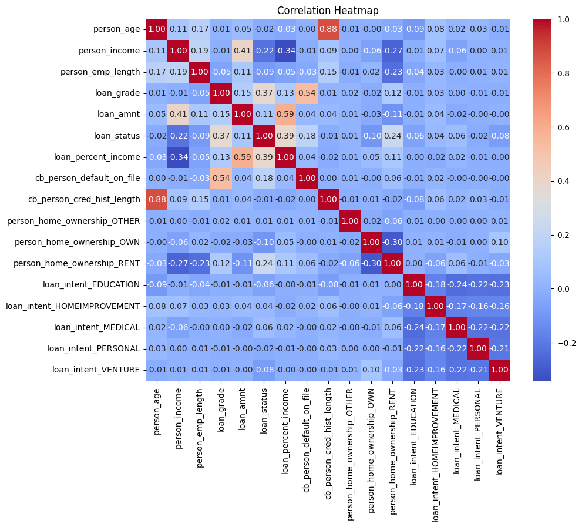

# Credit Risk Assessment: Loan Default Prediction

Predicts whether a loan applicant is **high-risk** (likely to default) or **low-risk**. The project compares four classical ML models with a neural network, and ships the best neural network as an interactive **Streamlit** web app.

- **Dataset:** [Credit Risk Dataset (Kaggle)](https://www.kaggle.com/datasets/laotse/credit-risk-dataset), 32,581 loan records
- **Notebook on Kaggle:** [ds-project-credit-risk-assessment](https://www.kaggle.com/code/rahmamabdelfattah/ds-project-credit-risk-assessment)
- **Full report:** [report.pdf](report.pdf)

## Results

Accuracy on a held-out 20% test set (6,453 applicants):

| Model | Accuracy |
|---|---|
| Perceptron | 80.2% |
| Logistic Regression | 86.0% |
| SVM (RBF kernel) | 91.4% |
| Random Forest (200 trees) | **93.5%** |
| Neural Network (baseline, 32→16) | 91.9% |
| Neural Network (tuned, 64→32→Dropout→16) | 92.2% |

The tuned neural network's confusion matrix on the test set:

- **Precision:** 92.6% of the applicants it flags as high-risk actually defaulted.
- **Recall:** it catches 70% of the defaulters.

<p align="center">
  
  
</p>

## Pipeline

1. **Cleaning**
   - Filled missing employment length with the median.
   - Dropped `loan_int_rate` (about 10% missing).
   - Removed duplicates and outliers: age over 100, income over $300k, employment over 50 years.
2. **Feature engineering**
   - Recomputed `loan_percent_income` from the loan amount and income.
3. **Encoding**
   - Binary: default history (Y/N).
   - Ordinal: loan grade (A→1 … G→7).
   - One-hot: home ownership and loan intent.
4. **Split and scale**
   - Stratified 80/20 train/test split.
   - `StandardScaler` on the numeric features.
5. **Modeling**
   - Trained Perceptron, Logistic Regression, SVM and Random Forest.
   - Trained a Keras MLP with early stopping.
6. **Hyperparameter tuning**
   - Layer sizes, activation functions (ReLU / tanh / sigmoid).
   - Optimizers (Adam / RMSprop / SGD) and batch sizes.
7. **Deployment**
   - Saved the best model (`best_model.h5`), the scaler (`scaler.pkl`) and the feature columns (`columns.pkl`).
   - The Streamlit app loads all three.



## Run the app locally

```bash
git clone https://github.com/ZIADMAHMOUD0/credit-risk-assessment.git
cd credit-risk-assessment
pip install -r requirements.txt
streamlit run app.py
```

Then open http://localhost:8501, enter the applicant's details and click **Predict Risk**.

## Re-running the notebook

On Kaggle, attach the [credit-risk-dataset](https://www.kaggle.com/datasets/laotse/credit-risk-dataset) as an input and click **Run All**. Locally, download `credit_risk_dataset.csv` into the project folder. The notebook finds the file in either place.

## Project structure

```
├── app.py                                   # Streamlit web app
├── ds-project-credit-risk-assessment.ipynb  # EDA, preprocessing, training, evaluation
├── best_model.h5                            # Trained Keras model
├── scaler.pkl                               # Fitted StandardScaler
├── columns.pkl                              # Feature column order used in training
├── images/                                  # Plots exported from the notebook
├── report.pdf                               # Project report
└── requirements.txt
```

## Tech stack

Python · pandas · scikit-learn · TensorFlow/Keras · Matplotlib · Seaborn · Streamlit
